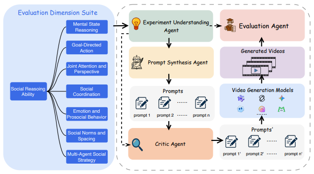
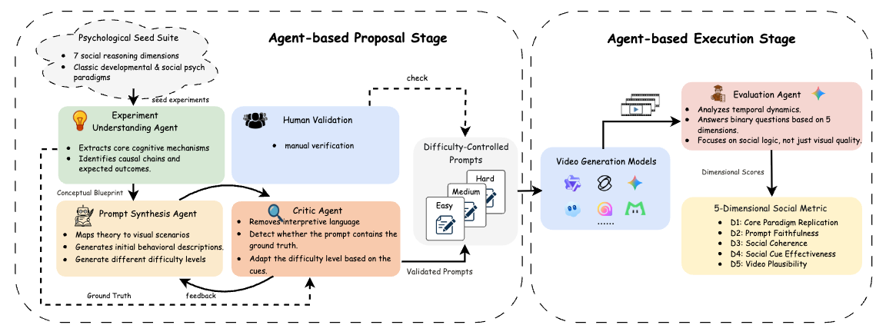

# SVBench: Evaluation of Video Generation Models on Social Reasoning

## Introduction

Recent text-to-video generation models have achieved remarkable progress in visual realism, motion fidelity, and text–video alignment. However, these models remain fundamentally limited in their ability to generate socially coherent behavior. Unlike humans—who effortlessly infer intentions, beliefs, emotions, and social norms from brief visual cues—current video generation models tend to render literal scenes without capturing the underlying causal or psychological logic.

While modern diffusion- and transformer-based architectures can synthesize dynamic scenes with striking realism and reproduce complex motion patterns and multi-agent interactions, they struggle to represent **why** people act the way they do—failing to capture the latent beliefs, intentions, emotions, and norms that structure real human interactions.

**SVBench** addresses this critical gap by introducing the first benchmark specifically designed to evaluate social reasoning capabilities in video generation models. Grounded in findings from developmental and social psychology, our benchmark organizes thirty classic social cognition paradigms into seven core dimensions:

- **Mental State Inference** - Understanding beliefs and theory of mind
- **Goal-Directed Action** - Recognizing intentional behaviors and goals  
- **Joint Attention & Perspective** - Following gaze and understanding perspectives
- **Social Coordination** - Turn-taking and collaborative behavior
- **Emotion & Prosocial Behavior** - Emotion recognition and helping behaviors
- **Social Norms & Spacing** - Personal space and social conventions
- **Multi-Agent Social Strategy** - Complex multi-agent interactions

Our benchmark reveals substantial performance gaps in current video generation systems: while modern models excel in surface-level plausibility, they systematically fail in **intention recognition**, **belief reasoning**, **joint attention**, and **prosocial inference**.

  

<i></i>

## Demos

The following videos are successful examples generated by the evaluated models, demonstrating correct social reasoning behaviors that align with the expected ground truth.

<table align="center">
  <!-- Row 1 -->
  <tr>
    <td><video src="asset/video/EXP_021-3-hard.mp4" width="280" controls autoplay loop muted></video></td>
    <td><video src="asset/video/EXP_018-2-medium.mp4" width="280" controls autoplay loop muted></video></td>
    <td><video src="asset/video/EXP_012-1-hard.mp4" width="280" controls autoplay loop muted></video></td>
  </tr>
  <tr>
    <td align="left"><b>Prompt:</b> A girl is crying on a park bench. A dropped ice cream cone is on the ground nearby. A woman is sitting on the other end of the bench. <b>Ground Truth:</b> The woman will notice the crying girl and offer comfort. <b>Question:</b> Does the woman notice the crying girl and offer comfort?</td>
    <td align="left"><b>Prompt:</b> On the floor of a room, there are red and blue rings. A boy is standing before them, appearing to hesitate about which one to choose. At this moment, a nearby woman first looks at the boy, then clearly points her finger at the red ring on the floor. <b>Ground Truth:</b> The boy will walk towards the red ring based on the woman's cue. <b>Question:</b> Does the boy walk towards the red ring based on the woman's cue?</td>
    <td align="left"><b>Prompt:</b> On a table are two open boxes, one red and one blue. A woman is extending her finger to point at the blue box. A child is looking at the woman's hand. <b>Ground Truth:</b> Child will look in the blue box. <b>Question:</b> Does the child look in the blue box?</td>
  </tr>
  <!-- Row 2 -->
  <tr>
    <td><video src="asset/video/EXP_022-1-easy.mp4" width="280" controls autoplay loop muted></video></td>
    <td><video src="asset/video/EXP_014-4-hard.mp4" width="280" controls autoplay loop muted></video></td>
    <td><video src="asset/video/EXP_028-5-medium.mp4" width="280" controls autoplay loop muted></video></td>
  </tr>
  <tr>
    <td align="left"><b>Prompt:</b> At the edge of a mud puddle, so expansive that one must step into it to retrieve anything from the middle, a child is unable to retrieve his toy. The boy is wearing clean cloth shoes, but the man is wearing clean but waterproof shoes. The boy looks at a man in clean shoes, also standing at the edge, and points at the toy. <b>Ground Truth:</b> The man will step into the mud to retrieve the toy, getting his shoes dirty. <b>Question:</b> Does the man step into the mud to retrieve the toy?</td>
    <td align="left"><b>Prompt:</b> A woman and a boy are sitting on the floor with a small toy between them. <b>Ground Truth:</b> The woman and the boy will maintain coordinated joint attention, repeatedly shifting their gaze between the toy and each other. <b>Question:</b> Do the woman and boy maintain coordinated joint attention, shifting their gaze between the toy and each other?</td>
    <td align="left"><b>Prompt:</b> An opaque screen stands in the middle of a table. A child on one side is reaching and fumbling, trying to find a toy on the other side. An adult, who can see the toy, is opposite them. <b>Ground Truth:</b> The adult will hand the toy to the child, knowing the child cannot see it. <b>Question:</b> Does the adult hand the toy to the child?</td>
  </tr>
  <!-- Row 3 -->
  <tr>
    <td><video src="asset/video/EXP_016-4-hard.mp4" width="280" controls autoplay loop muted></video></td>
    <td><video src="asset/video/EXP_011-1-hard.mp4" width="280" controls autoplay loop muted></video></td>
    <td><video src="asset/video/EXP_019-5-medium.mp4" width="280" controls autoplay loop muted></video></td>
  </tr>
  <tr>
    <td align="left"><b>Prompt:</b> A man and a woman are seated opposite one another at a table. The woman speaks a short sentence, pauses, and then turns her head to look directly at the man. <b>Ground Truth:</b> Man speaks next. <b>Question:</b> Does the man speak next?</td>
    <td align="left"><b>Prompt:</b> A woman directs her gaze toward a red toy on the floor. A boy is beside her, looking at the woman. <b>Ground Truth:</b> Boy will look at the red toy on the floor. <b>Question:</b> Does the boy look at the red toy on the floor?</td>
    <td align="left"><b>Prompt:</b> A man and a woman are positioned next to each other. The woman emits a loud laugh, and the man, his attention drawn by the sound, turns his head in her direction. <b>Ground Truth:</b> The man and boy adopt happy expressions (smile/laugh). <b>Question:</b> Do the man and the boy adopt happy expressions, such as smiling or laughing?</td>
  </tr>
  <!-- Row 4 -->
  <tr>
    <td><video src="asset/video/EXP_020-2-medium.mp4" width="280" controls autoplay loop muted></video></td>
    <td><video src="asset/video/EXP_010-9-easy.mp4" width="280" controls autoplay loop muted></video></td>
    <td><video src="asset/video/EXP_014-1-hard.mp4" width="280" controls autoplay loop muted></video></td>
  </tr>
  <tr>
    <td align="left"><b>Prompt:</b> A woman repeatedly reaches for a pen under a table, but her hand does not reach it. A boy is standing nearby, watching. <b>Ground Truth:</b> The boy will get the pen for the woman. <b>Question:</b> Does the boy get the pen for the woman?</td>
    <td align="left"><b>Prompt:</b> A marble is at the bottom of a tall, narrow tube on a table. Two tools are available nearby: a long, thin stick and a short, thick stick. A child first holds their hand up against the side of the tube to gauge its height, and then extends their hand towards the area where the two sticks are placed. <b>Ground Truth:</b> Child will pick the long thin stick. <b>Question:</b> Does the child pick the long thin stick?</td>
    <td align="left"><b>Prompt:</b> A woman holds a colorful toy next to her face. A child is nearby. <b>Ground Truth:</b> The woman and the child will shift their gaze back and forth between the toy and each other's faces, establishing coordinated joint attention. <b>Question:</b> Do the woman and the child shift their gaze back and forth between the toy and each other's faces?</td>
  </tr>
  <!-- Row 5 -->
  <tr>
    <td><video src="asset/video/EXP_023-2-medium.mp4" width="280" controls autoplay loop muted></video></td>
    <td><video src="asset/video/EXP_024-2-medium.mp4" width="280" controls autoplay loop muted></video></td>
    <td><video src="asset/video/EXP_014-7-hard.mp4" width="280" controls autoplay loop muted></video></td>
  </tr>
  <tr>
    <td align="left"><b>Prompt:</b> A woman is sitting on an empty park bench. A man sits down right next to her. She gets a tense, uncomfortable feeling. <b>Ground Truth:</b> The woman will shift away from the man to increase her personal space. <b>Question:</b> Does the woman shift away from the man to increase her personal space?</td>
    <td align="left"><b>Prompt:</b> A woman is next in line at a coffee counter. A man walks up and stands in front of her, and she stares at the back of his head with a frown. <b>Ground Truth:</b> The woman will verbally correct the man, telling him to go to the back of the line. <b>Question:</b> Does the woman show displeasure or confront the man about cutting the line?</td>
    <td align="left"><b>Prompt:</b> A woman and a boy are standing face-to-face, and the woman holds a toy car between them. <b>Ground Truth:</b> The woman and the boy will engage in reciprocal, back-and-forth gazes and interactions between the toy and each other's faces. <b>Question:</b> Do the woman and the boy engage in reciprocal, back-and-forth gazes between the toy and each other's faces?</td>
  </tr>
</table>

## Overview

  

<i> SVBench framework overview</i>

### Pipeline Framework

SVBench employs a fully **training-free, agent-based pipeline** to construct and evaluate social reasoning tasks for video generation. The framework consists of two main stages:

#### Agent-Based Generation Stage

This stage transforms abstract psychological paradigms into concrete, video-ready prompts through three specialized agents:

1. **Experiment Understanding Agent**
   - Processes psychological experiment descriptions
   - Distills underlying social reasoning mechanisms
   - Creates structured conceptual blueprints with key concepts, test points, and ground truths
   - Ensures downstream generation is grounded in cognitive constructs rather than superficial details

2. **Prompt Synthesis Agent**
   - Translates abstract cognitive paradigms into visually grounded scenarios
   - Generates action-oriented descriptions using only observable behaviors
   - Ensures temporal feasibility (5–10 second clips)
   - Creates concrete instantiations with specific entities and contexts
   - Maintains separation between action descriptions and expected outcomes

3. **Critic Agent**
   - Enforces conceptual neutrality by removing interpretive language
   - Detects and eliminates ground-truth leakage
   - Generates difficulty-controlled variants (easy, medium, hard) by manipulating social cues
   - Provides structured feedback for iterative refinement
   - Ensures validated, difficulty-controlled prompts for each experiment

#### Agent-Based Evaluation Stage

Generated videos are assessed using a Vision-Language Model (VLM) judge across **five discrete, interpretable dimensions**:

- **D1: Core Paradigm Replication** - Correctness of psychological phenomenon instantiation
- **D2: Prompt Faithfulness** - Adherence to specified agents, objects, and scenes
- **D3: Social Coherence** - Causal and social plausibility of agent behaviors
- **D4: Social Cue Effectiveness** - Quality of perceptual cues (gaze, gestures, etc.)
- **D5: Video Plausibility** - Visual stability baseline (isolates generation vs. reasoning failures)

Each dimension is scored as a binary {0, 1}, with the overall score computed as the average: **S_overall = (1/5) × Σ D_k**

This discrete evaluation approach enhances robustness by framing assessment as unambiguous factual questions, aligning more closely with human categorical judgments and substantially reducing inter-trial variance.

### Key Features

✅ **First benchmark for social reasoning in video generation**  
✅ **Grounded in developmental and social psychology**  
✅ **30 classic experiments spanning 7 core social cognition dimensions**  
✅ **Fully training-free, scalable pipeline**  
✅ **Difficulty-controlled scenario generation**  
✅ **Interpretable 5-dimensional evaluation framework**  
✅ **Comprehensive evaluation of 7 state-of-the-art video generation models**

### Benchmark Results

Our extensive evaluation across eight state-of-the-art video generation systems reveals:

- **Top performers** (Sora2-Pro: 79.6%, Veo-3.1: 72.4%) show strong implicit priors for human motion causality and intention-driven interactions
- **Mid-tier models** (Hailuo02-S: 56.4%, Kling2.5-Turbo: 52.2%, Wan2.2: 48.3%) struggle with coordinated multi-agent behavior and abstract social inference
- **Open-source models** (HunyuanVideo: 30.8%, LongCat-Video: 39.2%, LTX-1.0: 27.6%) operate at substantially lower performance levels
- **Critical gap**: Models excel at physical reasoning but lack explicit mechanisms for social reasoning

<b>Experimental Results of Selected 15 Tasks Across 8 Models (Performance in %)</b>

<table align="center">
  <tr>
    <th>Task Dimension</th>
    <th>Sub-Task</th>
    <th>Hailuo02-S</th>
    <th>Kling2.5-turbo</th>
    <th>Sora2pro</th>
    <th>Veo-3.1</th>
    <th>HunyuanVideo</th>
    <th>Longcat-Video</th>
    <th>LTX-1.0</th>
    <th>Wan2.2</th>
  </tr>
  <tr>
    <td rowspan="2">Goal Directed Action</td>
    <td>Detour Reaching</td>
    <td>51.4</td><td>48.6</td><td><b>68.6</b></td><td>62.9</td><td>31.4</td><td>28.6</td><td>17.1</td><td>42.2</td>
  </tr>
  <tr>
    <td>Tool Selection</td>
    <td>55.0</td><td>45.0</td><td><b>85.0</b></td><td><b>85.0</b></td><td>17.5</td><td>28.6</td><td>30.0</td><td>57.8</td>
  </tr>
  <tr>
    <td rowspan="3">Joint Attention & Perspective</td>
    <td>Gaze Following</td>
    <td>44.4</td><td>33.3</td><td>62.2</td><td><b>68.9</b></td><td>35.6</td><td>44.4</td><td>28.9</td><td>28.9</td>
  </tr>
  <tr>
    <td>Pointing Comprehension</td>
    <td>75.0</td><td>67.5</td><td><b>87.5</b></td><td>82.5</td><td>30.0</td><td>57.1</td><td>22.9</td><td>71.1</td>
  </tr>
  <tr>
    <td>Joint Engagement</td>
    <td>45.0</td><td>45.0</td><td>82.5</td><td>82.5</td><td>50.0</td><td>31.4</td><td>30.0</td><td>44.4</td>
  </tr>
  <tr>
    <td rowspan="2">Social Coordination</td>
    <td>Turn Taking</td>
    <td>45.7</td><td>62.9</td><td><b>94.3</b></td><td>85.7</td><td>37.1</td><td>57.1</td><td>40.0</td><td>62.2</td>
  </tr>
  <tr>
    <td>Leader Follower Coord</td>
    <td>40.0</td><td>44.4</td><td><b>77.8</b></td><td>64.4</td><td>17.8</td><td>35.6</td><td>17.8</td><td>48.9</td>
  </tr>
  <tr>
    <td rowspan="4">Emotion & Prosocial Behavior</td>
    <td>Emotion Contagion</td>
    <td>66.7</td><td>75.6</td><td>82.2</td><td><b>88.9</b></td><td>46.7</td><td>65.0</td><td>57.8</td><td><b>88.9</b></td>
  </tr>
  <tr>
    <td>Instrumental Helping</td>
    <td><b>68.9</b></td><td>55.6</td><td>62.2</td><td>48.9</td><td>31.1</td><td>33.3</td><td>24.4</td><td>35.6</td>
  </tr>
  <tr>
    <td>Empathic Concern</td>
    <td>80.0</td><td>76.0</td><td><b>100.0</b></td><td><b>100.0</b></td><td>24.0</td><td>60.0</td><td>20.0</td><td>66.7</td>
  </tr>
  <tr>
    <td>Costly Helping</td>
    <td>57.5</td><td>37.5</td><td><b>95.0</b></td><td>75.0</td><td>22.5</td><td>31.4</td><td>15.0</td><td>37.8</td>
  </tr>
  <tr>
    <td rowspan="3">Social Norms & Spacing</td>
    <td>Proxemics Personal Space</td>
    <td>47.5</td><td>47.5</td><td><b>65.0</b></td><td>45.0</td><td>25.0</td><td>25.0</td><td>35.0</td><td>22.2</td>
  </tr>
  <tr>
    <td>Queue Behavior</td>
    <td>55.6</td><td>40.0</td><td><b>82.5</b></td><td>75.6</td><td>33.3</td><td>20.0</td><td>20.0</td><td>20.0</td>
  </tr>
  <tr>
    <td>Dominance Display</td>
    <td>80.0</td><td>75.0</td><td>75.0</td><td><b>82.5</b></td><td>35.0</td><td>30.0</td><td>37.5</td><td>64.4</td>
  </tr>
  <tr>
    <td>Multi-Agent Social Strategy</td>
    <td>Helping Based on Visual Perspective</td>
    <td>42.2</td><td>42.2</td><td><b>84.4</b></td><td>53.3</td><td>24.4</td><td>40.0</td><td>17.8</td><td>33.3</td>
  </tr>
  <tr>
    <td><b>Overall</b></td>
    <td><b>-</b></td>
    <td><b>56.4</b></td><td><b>52.2</b></td><td><b>79.6</b></td><td><b>72.4</b></td><td><b>30.8</b></td><td><b>39.2</b></td><td><b>27.6</b></td><td><b>48.3</b></td>
  </tr>
</table>

These findings highlight the fundamental distinction between perceptual realism and socially coherent behavior, revealing where current generation systems succeed or fundamentally fail in generating socially intelligent video content.

